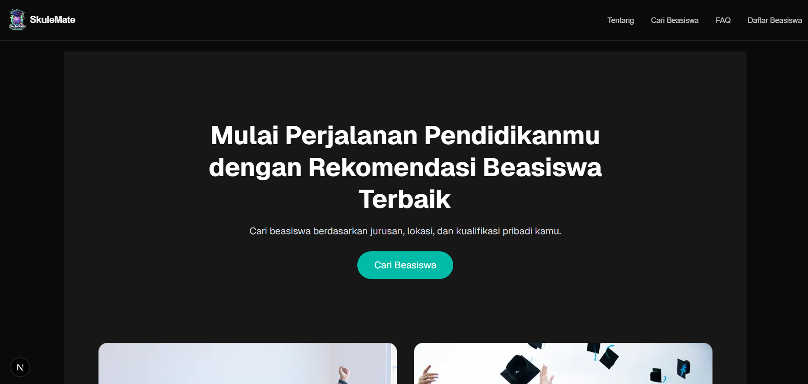
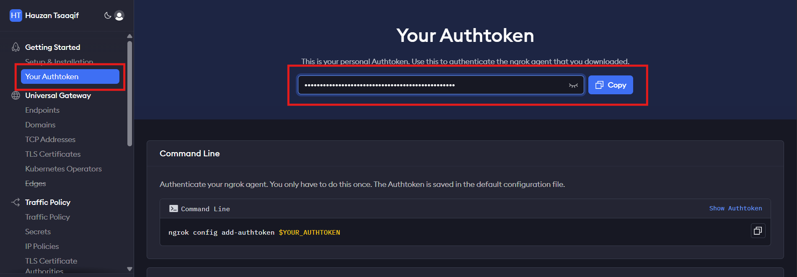
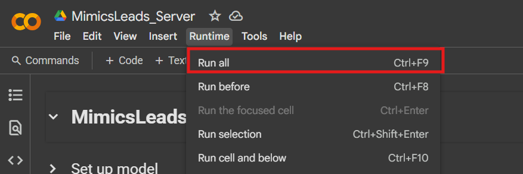
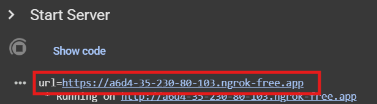
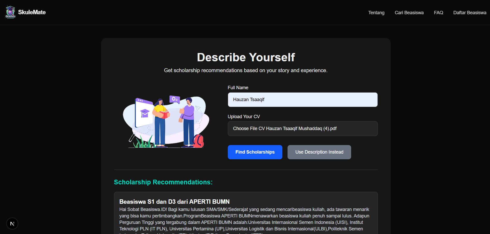

# 🎓 SkuleMate — AI-Powered Scholarship Finder

**SkuleMate** is an intelligent scholarship search platform designed to simplify and personalize the way users find scholarships. Powered by **Natural Language Processing** and **custom-trained AI models**, SkuleMate analyzes your profile or CV and matches it with thousands of curated scholarships using **semantic similarity** — no more manual searching.

> 🧠 Just upload your CV or write a short bio. Let the AI find your best-fit scholarships.



---

## 🚀 Key Features

- 🤖 **AI-Powered Matching**: Automatically matches your profile with scholarship descriptions using sentence embedding techniques.
- 📄 **CV or Text Input**: Upload your resume or describe yourself manually.
- 🔍 **Smart Retrieval**: Uses semantic search with SBERT to find scholarships with the highest relevance.
- 🌐 **Built with Next.js**: A modern, performant, and scalable frontend framework.

---

## 🧠 The AI Model

The core matching engine uses **Sentence-BERT (SBERT)** fine-tuned on a **custom-mined scholarship dataset**. It evaluates the semantic similarity between user input and scholarship descriptions to deliver precise results.

- 🤗 Model Hosted on Hugging Face:  
  🔗 https://huggingface.co/hauzantsaaqif/beasiswa_sbert

- 📚 Custom dataset from large-scale scholarship data mining
- 🔍 Embedding-based similarity matching

---

## 🔧 skuleMate Web App - Getting Started (User-Friendly)

Welcome to skuleMate! Follow the steps below to get started and set up your API connection.

### 1. **Visit the Website**

- Go to the skuleMate Web App at [https://skule-mate.vercel.app/](https://skule-mate.vercel.app/).

### 2. **Go to the Settings Page**

- Once you're on the homepage, click on the **Settings** link in the navigation bar or directly navigate to the settings page.

### 3. **Create an Account on Ngrok**

- Go to [Ngrok's website](https://ngrok.com/) and create an account.
- Once logged in, copy your **NGROK Auth Token**.  
  **(See example image below)**



### 4. **Open the AI Server on Colab**

- Open the AI server on Google Colab by clicking the link below:  
  [Colab Server Link](https://colab.research.google.com/drive/1ekhncbLWpavb7338ltb2KOqeu4QILDmE?usp=sharing)

### 5. **Paste Your Ngrok Token**

- In the Colab notebook, find the input field for Ngrok Token.
- Paste your **Ngrok Auth Token** into this input field.

### 6. **Connect to Colab Runtime**

- You don't need a GPU, just connect to the Colab runtime by clicking the **Connect** button in the top-right corner.

### 7. **Run All Cells**

- Press `Ctrl + F9` or go to **Runtime > Run all** to execute all cells in the Colab notebook.  
  **(See example image below)**



### 8. **Copy the Generated API Link**

- Wait for the API link to appear. Once it does, copy the generated link.  
  **(See example image below)**



### 9. **Paste the API Link in Settings**

- Return to the skuleMate settings page.
- Paste the copied **API link** into the settings input field and click **Save API**.

### 10. **You're Ready to Start!**

- After saving the API link, you’re ready to start using skuleMate and enjoy the features! 🎉

---

### Need Help?

If you encounter any issues, feel free to reach out to our support team at hauzantsaaqif28@gmail.com.

---

## 🛰️ Model Deployment (Server)

The backend model is served via:

- ☁️ **Google Colab** for lightweight, serverless hosting
- 🌐 **Ngrok** for exposing FastAPI endpoints publicly
- ⚡ **FastAPI** for efficient inference serving

To deploy the model:

1. Open the Colab notebook:  
   [📓 Colab Server Notebook](https://colab.research.google.com/drive/1ekhncbLWpavb7338ltb2KOqeu4QILDmE?usp=sharing)

2. Mount Google Drive using the shared model files:  
   [📁 Model Drive Folder](https://drive.google.com/drive/folders/1BfqavA0YotO5Sg02tt5UHvdzF2BZjdis?usp=sharing)

3. Replace the `NGROK_AUTH_TOKEN` with your own key when prompted

4. Copy the **Ngrok Public URL** once the server starts

---

## 🧑‍💻 Running the Web App (Next.js)

To use the SkuleMate Web Interface:

1. **Clone the Repository**:

   ```bash
   git clone https://github.com/ArditBaskara/skuleMate.git
   cd skuleMate

   ```

2. **Update the API URL**:  
   Replace all model API URLs with the Ngrok Public URL you copied from Colab.

Edit the following files:

- `app/api/detectCV/route.ts`
- `app/api/detectText/route.ts`

3. **Install dependencies**:

   ```bash
   npm install

   ```

4. **Start the UI Website**:

   ```bash
   npm run dev

   ```

Now, you're ready to test the app 🍱

## Example Output



## 🧰 Tech Stack

- **Frontend**: Next.js (React + TypeScript)
- **Backend**: FastAPI (served via Colab + Ngrok)
- **Model**: SBERT (custom fine-tuned model)
- **Deployment**: Google Colab + Ngrok
- **Data**: Custom-mined scholarship dataset

---

## 🖼️ Example Usage

1. **Input CV (PDF/text) or a brief self-description**
2. **AI matches your profile with top scholarships**
3. **Instantly receive tailored recommendations**

📺 **For a full demonstration, watch the documentation video here**:  
[👉 SkuleMate Demo on YouTube](https://youtu.be/SYM3-IZIcdc)

---

## 🤝 Contributions

Contributions are welcome!
Feel free to open issues or submit pull requests to improve SkuleMate.

---

## 📄 License

This project is licensed under the **MIT License** — use freely with attribution.

---

> “No more endless browsing. Let SkuleMate find the right scholarship for you.”
